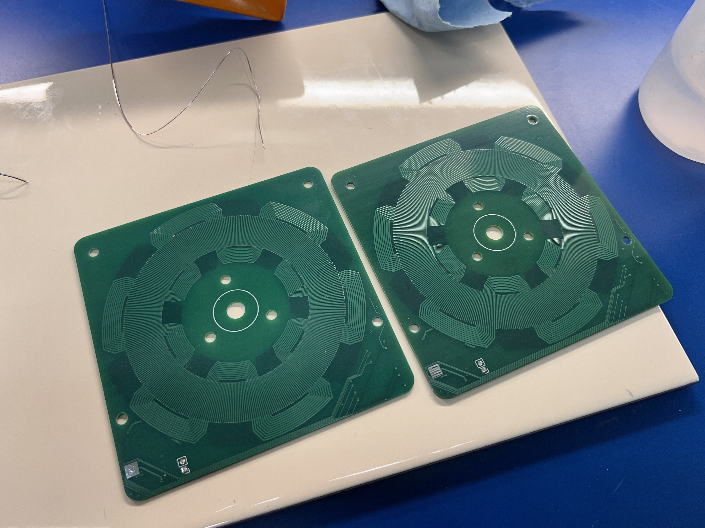
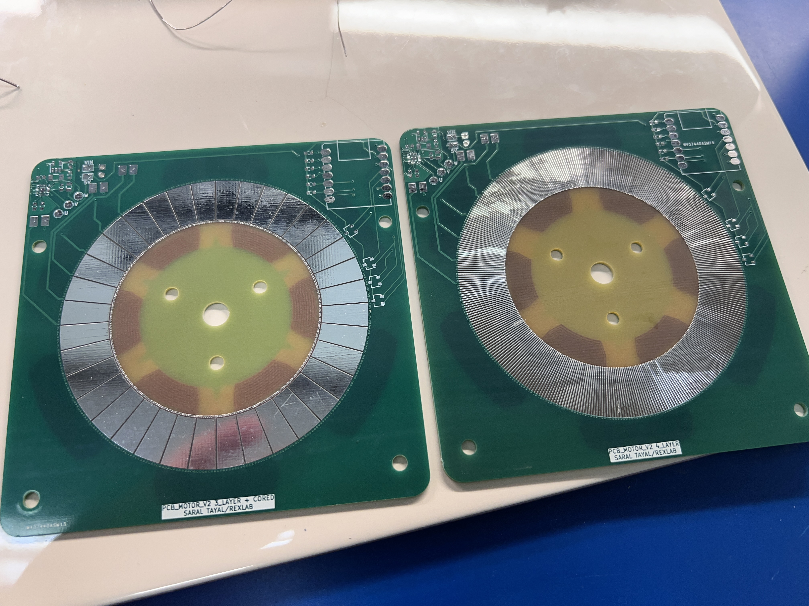
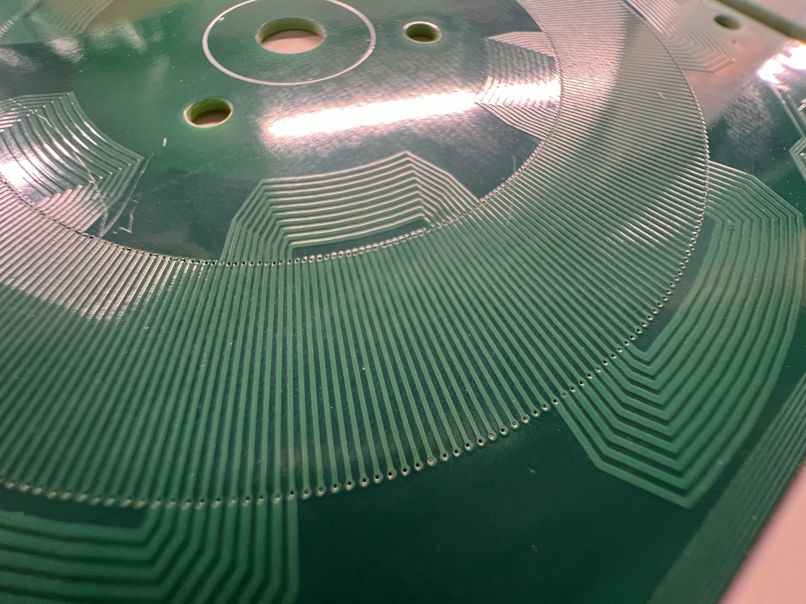
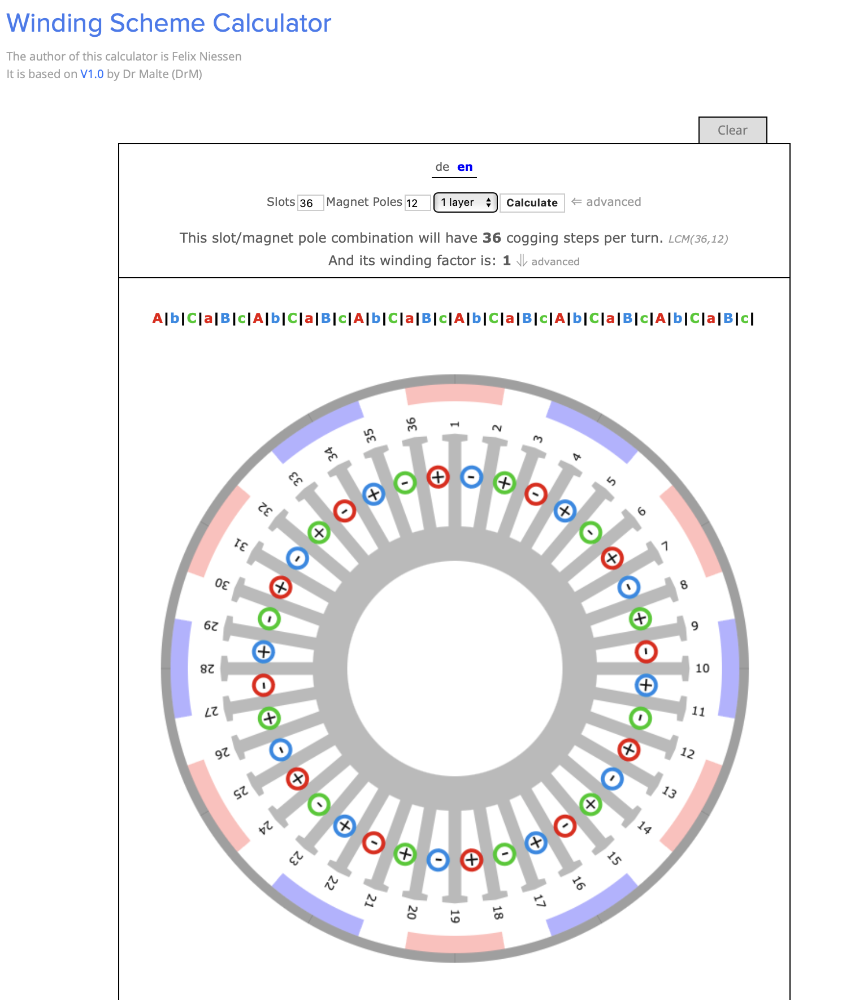
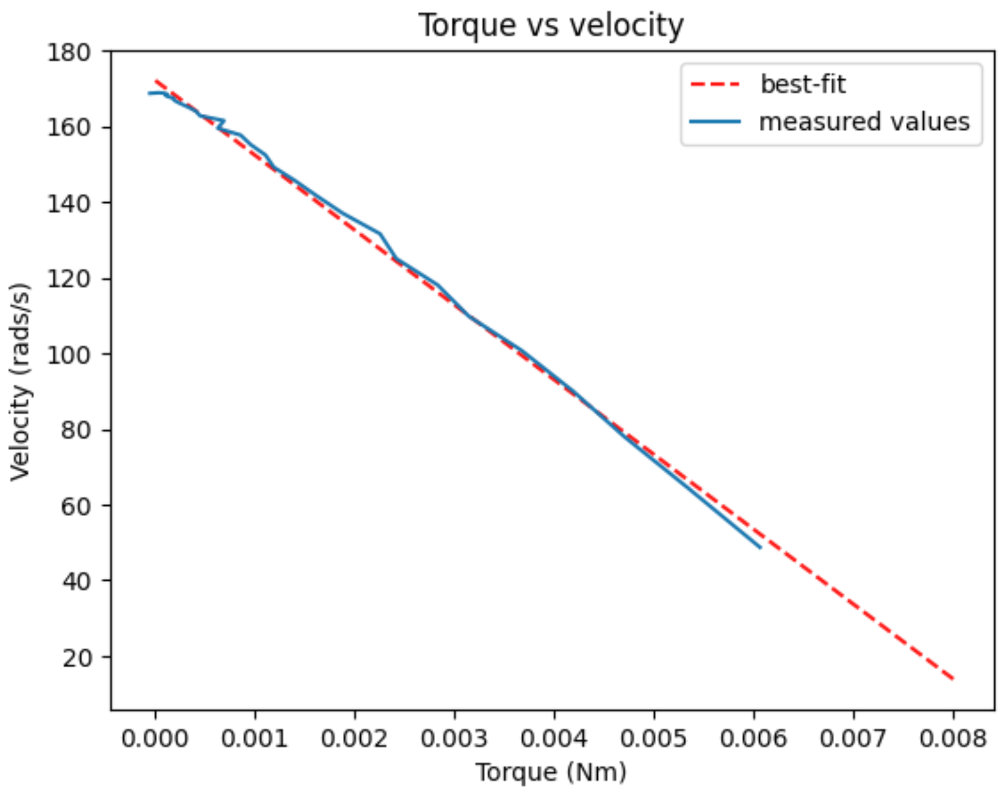
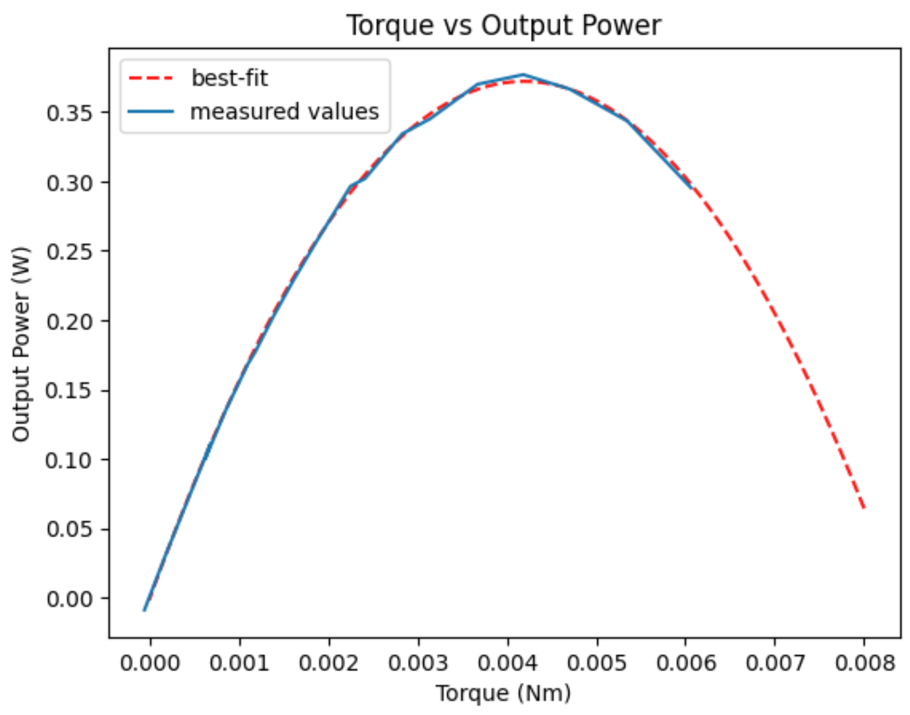

# PCB_Motors
Code &amp; Firmware to generate continuous coil PCB motor designs

Bare PCB Pictures: 




Completed Dual PCB Stator, center rotor motor


## Media

Videos of the motor spinning and build pictures are in the Media folder

## Cloning the repo
Note that if you clone the repo, you will also need to intialize the submodules. You can do so as follows

```
git clone git@github.com:SaralTayal123/PCB_Motors.git
cd PCB_Motors

git submodule init
git submodule update
```

You will also need to delete/comment out line 6 of `kicad-coil-plugins/pcb_json.py` as follows

```
import json
import pandas as pd
import numpy as np
import matplotlib.pyplot as plt

# from helpers import rotate ### Modify by commenting out ###
```

## How to build your own motors

Option 1 *(Suggested)*: Simply use the existing kicad design and order the current designed version through a manufacturer like PCBway.

Option 2: Design your own PCB motors using the python script. Steps for that are outlined below

### Step 1: 
 
Calculate the appropriate winding pattern. Using the following link, find a slot-magnet combo that will produce a repeating pattern of "A", "B", "C". The ABC phases can be in any order and any case (upper or lower) as long as the pattern that they appear in are consistant. The other restriction is that your Slot number needs to be a multiple of 6 given this winding pattern. For example, I used a 36 slot, 12 magnet pole design and achieved a pattern of "AbC" as pictured below. The upper/lower case refers to the polarity of the coil phase and can be easily switched during wiring, which is why it's not case sensitive as long as the pattern is repeated. 

Calculator link: https://www.bavaria-direct.co.za/scheme/calculator/



This step can be a little tedious since you will need to find magnets that will fit your motor inner/outer diameter while matching the pole pole pair count. If you need more flexibility on not requiring slots be a multiple of 6, or follow a different winding pattern, then this wave motor design isn't the best option for you, and a traditional repeated coil design like this is ideal for you: https://github.com/atomic14/kicad-coil-plugins/tree/216a77b6a4d9532b090e98a6620eb1c3f18db77d


### Step 2: Use the python script

Using the slot/pole combo from step 1 (or using the reccomended 36/12 design), open the continous_coil_gen.ipynb python notebook. Here, input the inner and outer diameter of your coils. You should tailor these to be the width of your magnets to make your motor as effective aas possible. You can also tune a few PCB trace parameters here depending on the capabilities of the PCB manufacturing available to you

### Step 3: Import the Kicad coil design into Kicad

Using the [tool here](https://github.com/atomic14/kicad-coil-plugins/tree/216a77b6a4d9532b090e98a6620eb1c3f18db77d), import your coil design into kicad. If you decide to work with my example board design in KiCad, you should right click the imported coil and move it to the origin to center it perfectly for your design.

Finally, integrate your coils with the rest of the motor controller circuitry to create your own PCB Motor!


## BOM for the example motor
Simple BOM, Cost is ~$25 + shipping
PCBWAY cost ~$26 for 5 boards + Shipping
Magnets 24 pieces @ $0.37 each = $30 (I recommend some spares as they tend to snap/break if they fly out of your hand into a metal object) : https://www.magnet4less.com/neodymium-bar-magnets-1-2-in-x-1-4-in-x-1-8-in-n42

### Rough Specs

Configuration: 2 sided PCB Stator, Rotor in the middle, 8V, Star wiring pattern

Stall torque: 0.008 Nm
Top Speed: 170 Rad/s
Max Power draw: 5 Watts
Peak output power (measured torque x angular velocity): 0.3 Watts




### Testing

Motor charecterization was performed by using 3d printed disc with bolts to serve as a known inertial load to our motor. Measuring the angular acceleration at a full torque command at each angular velocity allowed us to charecterize the torque curve of the motor and the output power curve for the motor (pictured above). This sort of testing is commonnly used for testing cars and is called an inertial dyno. The extra inertial load attached to the PCB motor is pictured below.


The neat thing about using this test is that all one needed to do was add some extra data-logging firmware, and the PCB motors can self-charecterize themselves without any external equipment!

We were also able to monitor a DC Amp-meter on the input power line of the motor to measure system efficiency, howerver there was a lot of switching noise on that power rail to measure a clean signal. Noisy graph is available in Media/torq_eff.png image. The efficiency test needs to be repeated with a low pass filter and a secondary means to test the motor with the motor controller out of the loop. 

### TODO: 
* Why this design
* Star vs Delta wiring
* How to pick winding factor and why conventional winding table won't work


Motor winding image credits: 
https://www.bavaria-direct.co.za/info/#prettyPhoto